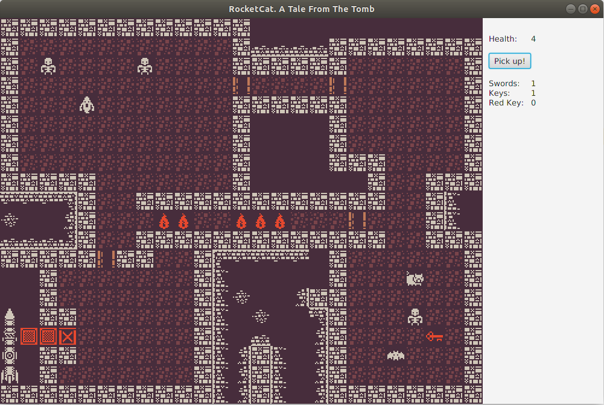

# Codecool Quest

This is a tile-based RPG game. The project is using JavaFX and Oracle's Java 8.

## Some features:

* player is not able to stand on walls or monster tiles
* there are items that can be picked up by player like key or sword

* key is opening door
* sword gives additional power when we attact mosters
* moster attack as at the same time as we attack him

* monsters have different behaviours

## Graphics

The tiles used in the game are from [1-Bit Pack by Kenney](https://kenney.nl/assets/bit-pack), shared on [CC0 1.0 Universal license](https://creativecommons.org/publicdomain/zero/1.0/).

